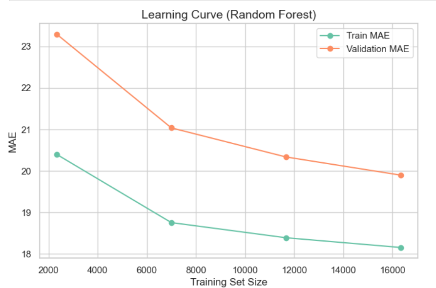
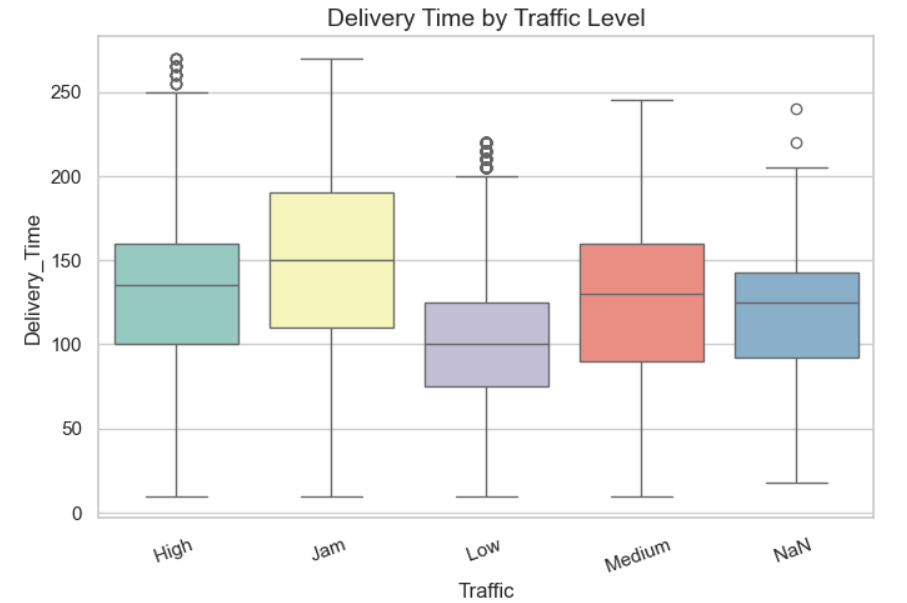
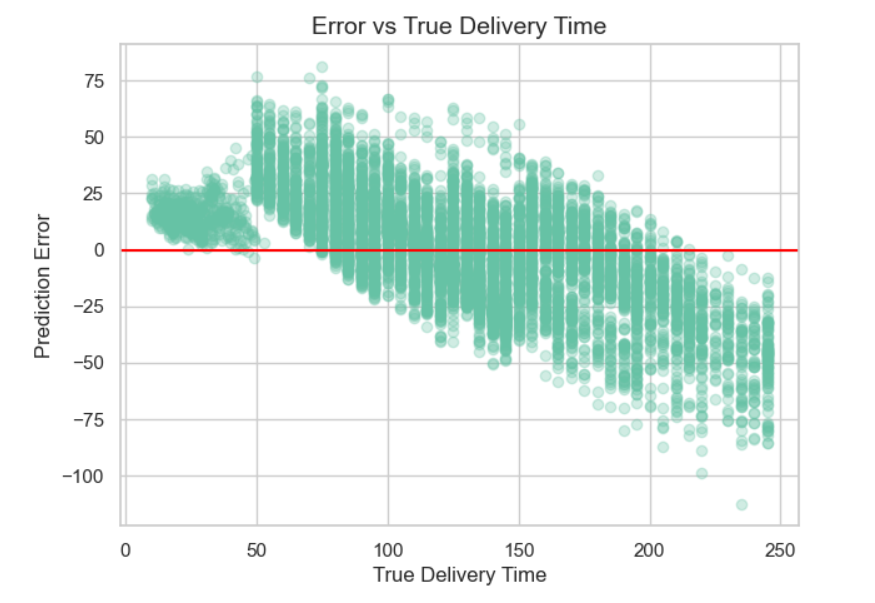
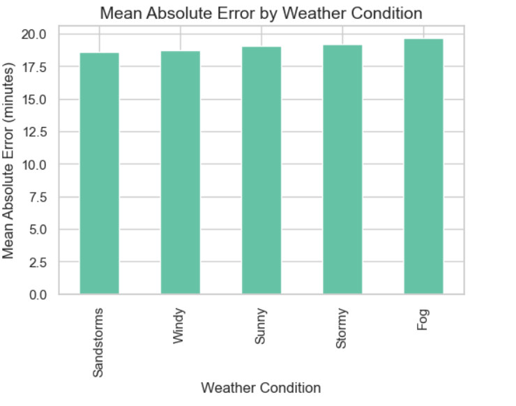

#  Delivery ETA Prediction & Delay Risk Classification

End-to-end Machine Learning project for predicting delivery time (ETA) and estimating late-delivery risk using the Amazon Delivery Dataset.

This project addresses two tasks:
1. **ETA Prediction (Regression)** – Predict delivery time in minutes.
2. **Delay Risk (Classification)** – Predict the probability that a delivery will be late.

Dataset used:  
https://www.kaggle.com/datasets/sujalsuthar/amazon-delivery-dataset

---

##  Problem Framing

The goal is to improve delivery reliability by:
- Predicting delivery time (ETA) using regression.
- Predicting whether a delivery will be late using classification.

Late deliveries were defined as orders whose delivery time exceeds the **75th percentile (160 minutes)** of the dataset (slowest 25%).  
This percentile-based threshold avoids arbitrary cutoffs and provides a balanced class distribution.

---

##  Exploratory Data Analysis & Model Evaluation


###  Delivery Time Distribution


- Delivery times are right-skewed, with most orders clustered between ~60 and 160 minutes.

- A long tail exists beyond 200+ minutes, indicating a small number of extremely delayed deliveries.

- This skew explains why MAE/RMSE are sensitive to outliers and why extreme delays are harder to predict.

**Insight**: Delivery times are not normally distributed and contain long-delay outliers.

###  Learning Curve (Random Forest)



- Both training and validation MAE decrease as the training set size increases, showing that the model benefits from more data.
- Validation MAE consistently remains higher than training MAE, indicating mild overfitting, but the gap narrows with larger datasets.
- The curves start to stabilize at higher data sizes, suggesting the model is approaching its generalization limit with the current features.
- No signs of severe underfitting are observed, as both errors are relatively low and improving.
- Overall, the model generalizes well, with only mild overfitting that was reduced through feature engineering and Random Forest regularization (max depth and minimum leaf size).


###  Delivery Time by Traffic Level



- Low traffic shows the lowest median delivery time (~100 minutes).

- Medium and High traffic increase delivery times noticeably.

- Traffic jams have the highest median (~150 minutes) and widest spread.

- Several high outliers appear in High/Jam traffic.

**Insight:** Traffic is a strong driver of delivery duration, especially under jam conditions.

###  Delivery Time by Weather Condition


- Sunny weather has the lowest median delivery time.

- Cloudy and Foggy conditions show higher medians and larger variability.

- Stormy and Sandstorms also increase delivery time dispersion.

- All adverse weather types show more extreme outliers.

**Insight:** Poor weather increases both average delivery time and uncertainty.

###  Average Delivery Time by Vehicle Type


- Scooters and vans have the lowest average delivery times (~115–117 minutes).

- Motorcycles and bicycles are slower on average.

- Bicycles show the highest variability, likely due to speed limitations and route constraints.

**Insight:** Vehicle type impacts delivery speed, with scooters/vans performing best.

##  Error Analysis

### Error vs True Delivery Time (Scatter Plots)


- For short deliveries (<50 minutes), errors are small and mostly positive, meaning the model slightly over-predicts very fast deliveries.

- For medium deliveries (50–150 minutes), predictions are centered closer to zero with moderate spread, indicating relatively good accuracy.

- For long deliveries (>170 minutes), errors become strongly negative, showing consistent under-prediction of extreme delays.

**Interpretation:** The model tends to overestimate very fast deliveries and underestimate very slow deliveries, a common regression effect where predictions are pulled toward the mean.


### Mean Absolute Error Error by Traffic Level


From the bar plot:

Low traffic → lowest error (~16 min)

Medium traffic → higher error (~20 min)

Traffic jams → highest error (~21 min)

**Interpretation:** Prediction errors increase with traffic severity. The model struggles most during traffic jams, likely due to higher variability and unpredictable congestion effects.


### Mean Absolute Error by Weather Condition


From the weather plot:

- Errors are lowest in sandstorms / windy conditions (slightly)

- Errors increase for sunny → stormy → foggy

- Fog shows the highest error (~20 min)

**Interpretation:** Adverse weather (especially fog and storms) leads to higher prediction error, suggesting the model finds it harder to estimate delivery times under poor visibility and unstable conditions.

##  Tech Stack

- Python  
- Pandas / NumPy  
- Scikit-learn  
- Matplotlib / Seaborn   
- Joblib 

## 📁 Project Structure
```
Delivery-ETA-Prediction/
│
├── ETA prediction and delay risk.ipynb
├── amazon_delivery.csv
├── rf_model.pkl
├── rf_classifier.pkl
├── requirements.txt
├── .gitignore
│
├── screenshots/
│   ├── Real Delivery Time Distribution.png
│   ├── Delivery Time by Traffic Level.png
│   ├── Delivery Time by Weather Condition.png
│   ├── Average Delivery Time by Vehicle Type.png
│   ├── Before and After.png
│   ├── Learning Curve.png
│   ├── Error Analysis by True Delivery Time.png
│   ├── Error Analysis by Traffic Level.png
│   └── Error Analysis by Weather Condition.png
│
└── README.md
```


---

##  Exploratory Data Analysis (EDA)

Key observations:
- Delivery times are right-skewed with a long tail of extreme delays.
- Traffic congestion and adverse weather significantly increase delivery time and variability.
- Scooters and vans perform fastest on average; bicycles show higher variance.
- Extreme delivery times were capped at the 99th percentile to stabilize training.

EDA included:
- Target distribution
- Delivery time vs traffic / weather / vehicle
- Outlier inspection
- Feature impact analysis

---

##  Feature Engineering

The following features were engineered:

- **Temporal:** hour, day of week, weekend flag
- **Geographic:** haversine distance between store and drop locations
- **Categorical encoding:** traffic, weather, vehicle, area, category (one-hot)

These transformations helped models capture temporal patterns and spatial effects.

---

##  Preprocessing

- Missing values:
  - Numerical → median
  - Categorical → mode
- Outliers:
  - Delivery time capped at 99th percentile
- Categorical variables one-hot encoded

---

##  Leakage Prevention

To avoid target leakage, the following columns were excluded:

- `Pickup_Time` (occurs after order placement)
- `Delivery_Time` and `Delivery_Time_raw` (targets)
- `Order_ID` (identifier only)
- Raw date/time columns (replaced by engineered temporal features)

This ensures the model only uses information available at prediction time.

---

## 🔀 Data Split Strategy

### Regression

A random 80/20 train–validation split with a fixed seed was used. This is suitable because individual deliveries are independent and the dataset does not show strong time-based patterns. Using a fixed seed ensures the results are reproducible.

### Classification

Stratified sampling was applied to preserve the proportion of late vs on-time deliveries in both training and validation sets. This prevents class imbalance issues and ensures fair evaluation.

---

##  Task A — ETA Prediction (Regression)

### Models
- **Baseline:** Predict mean delivery time
- **Final Model:** Random Forest Regressor

### Metrics

| Model         | MAE (minutes) | RMSE (minutes) |
|--------------|---------------|----------------|
| Baseline     | ~41.1         | ~51.3          |
| RandomForest| ~19.1         | ~24.1          |

Random Forest reduced MAE by more than 50% compared to baseline.

---

### Learning Curve

Training vs validation MAE shows:
- Decreasing error with more data
- Small, consistent gap → mild overfitting
- Good generalization

---

### Regression Error Analysis

- Very short deliveries are slightly overpredicted.
- Extreme delays (>170 minutes) are consistently underpredicted.
- Errors increase during traffic jams and adverse weather (fog/storms).

---

##  Task B — Delay Risk Classification

### Label Definition

Late = Delivery_Time_raw > 75th percentile (160 minutes)

---

### Models
- **Baseline:** Constant probability
- **Final Model:** Random Forest Classifier

---

### Metrics

| Model         | ROC-AUC | PR-AUC |
|--------------|---------|--------|
| Baseline     | ~0.50    | ~0.23   |
| RandomForest| ~0.95   | ~0.85  |

---

##  Operating Threshold Selection

The operating threshold was chosen by maximizing the F1-score on the validation set, resulting in a threshold of **0.34**.

F1-score was selected to balance **precision** and **recall**, ensuring that most late deliveries are detected while avoiding too many false alerts.

At this threshold:
- Precision on late deliveries: **78%**
- Recall on late deliveries: **85%**

This provides a strong tradeoff between catching delays and limiting unnecessary notifications.


---

##  Classification Error Insights

- Prediction error is lowest in low traffic and clear weather.
- Errors increase in traffic jams and fog/storms.
- Indicates higher uncertainty under adverse conditions.

---

##  Model Improvements

Based on learning curves and error analysis, the following improvements were applied:

- Added temporal features: **hour, day of week, and weekend flag**
- Engineered **geographic distance** using store and drop coordinates
- Capped extreme delivery times at the **99th percentile** to reduce outlier impact
- Tuned Random Forest parameters (**tree depth and minimum leaf size**) to reduce overfitting

These changes reduced validation error and narrowed the training–validation gap.


---


##  Installation & Setup

```bash
# Clone the repository
git clone https://github.com/antara483/Delivery-ETA-Prediction-and-Delay-Risk.git

cd Delivery-ETA-Prediction-and-Delay-Risk

# Create virtual environment
python -m venv venv
source venv/Scripts/activate  # Windows

# Install dependencies
pip install -r requirements.txt

# Run the Notebook

Launch Jupyter Notebook:

jupyter notebook
```
## A short note on what I changed

- Based on learning curves and error analysis, several improvements were applied.
- Temporal features (hour, day of week, weekend flag) and geographic distance were engineered to better capture delivery patterns.
- Extreme delivery times were capped at the 99th percentile to reduce the impact of outliers.
- For Random Forest, tree depth and minimum leaf size were tuned to limit overfitting and improve generalization.
- These adjustments reduced validation error and narrowed the train–validation gap.

## Bonus: Monitoring Plan

In production, the following would be continuously monitored:

- ETA performance using **MAE**
- Delay-risk performance using **PR-AUC**
- Feature drift in:
  - Traffic
  - Weather
  - Delivery distance
  - Order time
- Sudden increases in traffic congestion, average distance, or bad weather frequency would trigger alerts
- Predicted delay probabilities would be tracked for distribution shifts
- Actual delivery outcomes would be compared against predictions regularly
The model would be retrained whenever performance degradation or significant drift is detected.
---

##  Key Takeaways

- Strong improvement over baselines for both regression and classification
- Traffic, weather, distance, and time-of-day are major drivers of delivery time
- The model generalizes well with mild overfitting
- End-to-end practical ML pipeline implemented: **EDA → Feature Engineering → Modeling → Evaluation → Deployment-ready artifacts**

---
 

## 👤 Author

**Antara Arkasali**  
